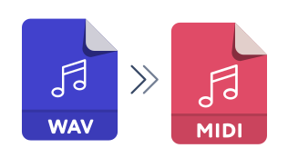

# Online WAV to MIDI Converter

### WAV (Waveform Audio File Format)

WAVE or WAV is short for Wave Audio Format. This format was used primarily for storing music on CDs and was also one of the main audio formats in the Windows operating system. Usually, music in this format is saved without loss of quality. This provides excellent audio quality, but these files are quite heavy and take up too much device memory.

File type: Audio\
File extension: .wav\
Developed by: Microsoft & IBM\
Initial release: 1991

### MIDI (Musical Instrument Digital Interface)

MIDI interfaces are a very useful tool for musicians to combine a wide variety of electronic instruments into one file. Essentially, MIDI is a standardized data transfer protocol for communicating various musical instruments, computers, controllers, and other devices. The interface itself appeared back in the 70s, but it still remains one of the main interfaces for working with musical instruments or creating music. With the help of MIDI, information is encoded about actions that are performed on a musical device - pressing keys, buttons, etc. There is a standard MIDI file - SMF, which is read by all MIDI devices. A separate midi track is a kind of musical score, but at the same time, it contains all the nuances of individual performance. MIDI melodies can be created using special programs similar to sheet music editors.

File type: Audio\
File extension: .mid\
Developed by: Dave Smith / Chet Wood\
Initial release: October 1, 1981
